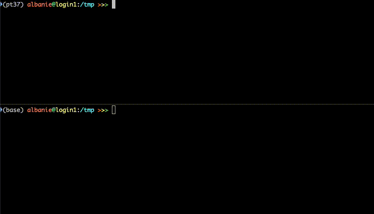

## watchlogs

`watchlogs` is a simple command line utility for watching multilpe log files and interleaving their contents to `stdout` as each log is appended to.  It aims to achieve the functionality of `tail -F`, but with more colour.

### Usage

`watchlogs --log_files /path/to/log1.txt,/path/to/log2.txt,....`

 

### Installation

Install via `pip install watchlogs`.  If you prefer to hack around with the source code, it's a [single python file](watchlogs/watchlogs.py).

### Behaviour

`watchlogs` has the following behaviour when `log.txt` is updated (assuming that `watchlogs --log_files log.txt` has been run):

* action: *appending* (**supported**) `echo "x" >> log.txt` (prints `x` to screen)

* action: *moving/rotating* (**supported**) `touch log2.txt ; echo "y" > log2.txt ; mv log2.txt log.txt` (prints`y` to screen)

* action: *overwritng in-place* (**not supported**): `echo "z" > log.txt` (`z` is lost)

### Implementation

`watchlogs` uses the [pygtail](https://github.com/bgreenlee/pygtail) library to monitor OS events.  

### Dependencies

* `Python >= 3.6`
* `seaborn`
* `colored`
* `pygtail`
